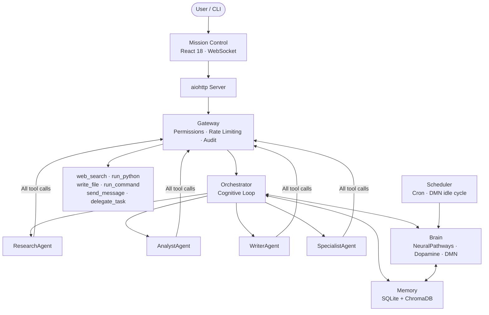
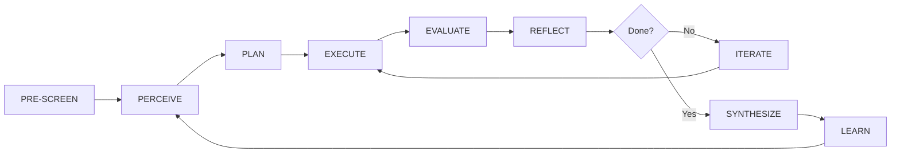

<div align="center">

# CMAS

**Cognitive Multi-Agent System**

<sub>An always-on agentic orchestration platform with a neuroscience-inspired cognitive architecture and persistent memory.</sub>

---


</div>

---

## What is CMAS?

CMAS is a persistent cognitive environment that orchestrates specialized AI agents through an eight-phase loop — Pre-Screen, Perceive, Plan, Execute, Evaluate, Reflect, Iterate, Synthesize. Unlike a standard chat interface, it maintains memory across sessions and projects, learns from past work, and runs proactive background processes even when you're not actively interacting with it.

The architecture is loosely modeled on neuroscience: agent routing is governed by Hebbian-weighted pathways, a dopamine-inspired reward signal calibrates quality expectations, and a Default Mode Network synthesizes creative insights during idle periods.

---

## Architecture



---

## Cognitive Loop



| Phase | What happens |
|---|---|
| **Pre-Screen** | Checks feasibility — missing packages, data dependencies, scientific constraints |
| **Perceive** | Retrieves prior memory, runs MCTS simulations to evaluate candidate approaches |
| **Plan** | Decomposes goal into 3–6 ordered tasks with agent type assignments |
| **Execute** | Dispatches up to 4 concurrent agents, each running a reason → act → reflect loop |
| **Evaluate** | Scores outputs 0–10; triggers dopamine reward signal; retries scores below 5.0 |
| **Reflect** | MetaCognition detects stuck states and adapts strategy |
| **Iterate** | Generates follow-up tasks if gaps remain; otherwise proceeds to synthesis |
| **Synthesize** | Writes final report, stores insights in memory, updates neural pathway weights |

---

## Key Components

**Orchestrator** — Coordinates the full cognitive loop. Does not execute tasks itself; decomposes, assigns, monitors, and synthesizes.

**Gateway** — Every tool call passes through here. Enforces per-agent permissions, rate limits (30 calls/60s), recursion depth (max 5), and writes a full audit log. Also exposes pause/resume/stop controls for running tasks.

**Memory** — Global, cross-project knowledge store. Combines SQLite (structured facts + lessons learned) with ChromaDB (semantic vector search). Frequently accessed entries rank higher automatically.

**Brain** — Five neuroscience-inspired modules: `NeuralPathways` (Hebbian agent routing), `DopamineSystem` (prediction error + reward), `PriorityDetector` (urgency classification), `Consolidator` (memory compression), `DefaultModeNetwork` (background creative synthesis).

**Agents** — Four types: `ResearchAgent`, `AnalystAgent`, `WriterAgent`, and `SpecialistAgent` (spawned dynamically for domain-specific tasks). All share a common reason → act → reflect sub-loop.

**Scheduler** — Runs alongside the server. Fires reminders, executes cron jobs, and triggers the DMN proactive cycle every 5 minutes.

---

## Installation

Requires Python 3.9+ and an OpenAI API key.

```bash
git clone https://github.com/joshdeansavv/CMAS.git
cd CMAS/MAIN_FOLDER

./setup.sh    # Interactive: creates venv, installs deps, generates .env + config.yaml
./start.sh    # Launch server
```

Open `http://localhost:8080`.

---

## Configuration

Key environment variables (`.env`):

```bash
OPENAI_API_KEY=sk-...        # Required
OPENAI_BASE_URL=...          # Optional — any OpenAI-compatible endpoint
TAVILY_API_KEY=tvly-...      # Optional — enables web search
DISCORD_TOKEN=...            # Optional — Discord channel
CMAS_PORT=8080
```

Runtime settings (`config.yaml`):

```yaml
models:
  default: gpt-4.1-nano
  research: gpt-4.1-mini
  temperature: 0.7

scheduler:
  proactive_interval: 300    # DMN idle cycle in seconds

channels:
  web:     { enabled: true }
  discord: { enabled: false }
  whatsapp: { enabled: false }
```

See `config.example.yaml` for the full reference.

---

## CLI

```bash
python3 -m cmas                          # Start server (default port 8080)
python3 -m cmas -p 3000                  # Custom port
python3 -m cmas --run "Your goal here"   # One-shot mode — no server, result to stdout
python3 -m cmas --run "..." --iterations 5 --human   # With iteration count and human checkpoints
```

---

## License

Distributed under the **PolyForm Noncommercial License 1.0.0**. Free for personal, academic, and non-commercial use. Commercial use requires a separate license — see [LICENSE](./LICENSE) for terms.
