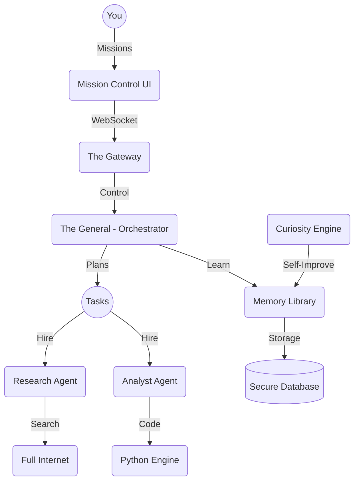

# 🌌 CMAS: Mission Control for Your AI Swarm

**CMAS** (Cognitive Multi-Agent System) is like a "Digital Brain" that runs a team of AI workers. It doesn't just chat with you—it plans missions, uses tools, and learns new things all on its own. 

Think of it as the **General** of your own personal AI army.

---

## 🧠 How the Brain Works (Plain English)

CMAS is built to work like a real human brain. Here are the main parts:

### 1. The General (The Orchestrator)
When you give CMAS a goal (like "Research how to travel to Mars"), the General doesn't just guess. It sits down, draws a map, and breaks the big goal into tiny jobs. Then it hires "specialists" (little AI agents) to do those jobs.

### 2. The Traffic Guard (The Gateway)
The Guard makes sure no one breaks the rules. It keeps your computer safe, watches how much power the AI is using, and writes down everything the AI does in a logbook so you can check it later.

### 3. The Library (The Memory)
CMAS has a photographic memory. It remembers every conversation you've ever had and every file it has ever read. It can search through thousands of pages of notes in a split second to find the answer you need.

### 4. The Curiosity Engine (Thinking while you Sleep)
Most AI only works when you talk to it. CMAS is different. When you aren't using it, the "Curiosity Engine" kicks in. It thinks about what it learned, connects new ideas, and even goes on the internet to learn things it thinks might be useful for your next mission.

---

## 🕹️ Mission Control (The Web App)

CMAS comes with a beautiful, futuristic dashboard called **Mission Control**. 

*   **Watch the Swarm**: See your AI agents talking to each other in real-time.
*   **Deep Dive**: Click into any agent to see exactly what they are thinking and what tools they are using.
*   **Project Manager**: Organize your life into "Missions." Each mission keeps its own files and notes separate from the others.

---

## 🚀 Quick Start (In 3 Steps)

Getting CMAS running is as easy as 1-2-3:

1.  **Setup**: Run the setup script to give the brain its settings.
    ```bash
    ./setup.sh
    ```
2.  **Launch**: Start the server.
    ```bash
    ./start.sh
    ```
3.  **Command**: Open `http://localhost:8080` in your browser and start your first mission!

---

## 🏗️ The System Map



---

## 🌟 Why is this different?

Most AI is just a "text box." CMAS is an **Environment**. 
*   It **stays alive** even after you close the tab.
*   It **actually works** by writing files, running code, and doing research.
*   It **gets smarter** the more you use it.

---

<div align="center">
  <i>Made with ❤️ by joshdeansavv. Ready to explore the stars.</i>
</div>
