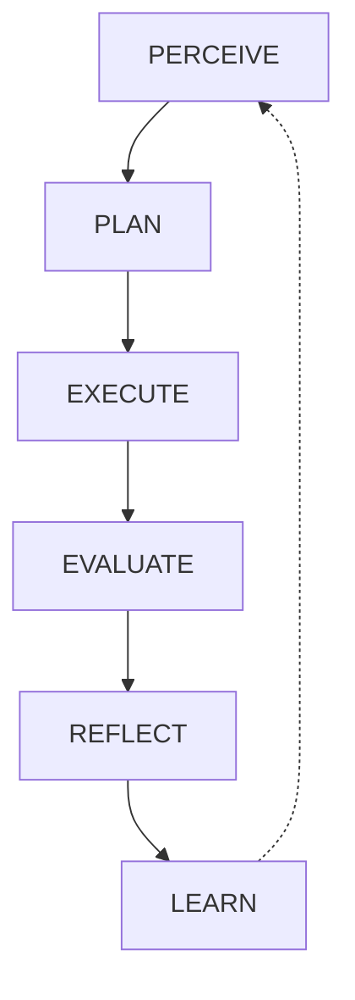

<div align="center">
  
  <h1>🧠 CMAS</h1>
  <h3>Cognitive Multi-Agent System</h3>
  <p><em>An always-on, highly-steerable agentic framework powered by brain-inspired intelligence.</em></p>

  [](#)
  [](https://www.python.org/)
  [](#)

</div>

---

> **CMAS** is a persistent AI framework that runs 24/7. It dynamically spawns specialized sub-agents, launches deep multi-step research investigations, safely executes code, manages custom long-term persistence, and actively learns from every interaction using localized dopamine-reward pathways.

## ✨ Key Features

- **🌐 Stunning Interactive Dashboard:** A brand new, production-grade Vite+React Single Page Application featuring Glassmorphism, Dark Mode, and robust WebSocket reconnects.
- **👁️ Live Observability HUD:** Monitor exactly what your specialized sub-agents are doing autonomously with real-time Roster Tracking and a streaming Telemetry Log that prevents chat spam.
- **🎮 Ultimate Interactivity (Steering):** Click the *Steer* button to seamlessly interrupt a thinking agent's Async LLM loop, forcing an explicit course-correction without breaking context!
- **🤖 Autonomous Auto-Delegation:** CMAS can spin up highly specialized sub-agents (e.g., `ResearchAgent`, `AnalystAgent`) to divide and conquer large data analysis objectives independently.
- **📍 Universal Access:** Talk to your cluster locally via the Web Dashboard, or hook it up natively to **Discord** and **WhatsApp (Twilio)**.
- **🧠 Brain-Inspired Architecture:** Features Hebbian learning, default-mode network background thinking, and a built-in dopamine-driven reward loop for strategy refinement.

---

## 🚀 Quick Start

Getting started with CMAS takes less than 60 seconds thanks to our interactive bash wizard!

```bash
# 1. Clone the repository
git clone https://github.com/joshdeansavv/CMAS.git
cd CMAS

# 2. Run the automated interactive wizard
./setup.sh

# 3. Boot the AGI Framework and hit localhost:8080!
./start.sh
```

> **Note:** The `setup.sh` wizard actively provisions your Python environment (`.venv`), registers dynamic tools, downloads required libraries, and interactively configures your preferred Local or Cloud LLMs! 

---

## 🏗️ Architecture & Cognitive Loop

CMAS does not just generate text—it *thinks*. The core loop is mapped to neuroscience models:



### Brain Systems
- **Neural Pathways** — Hebbian learning ensures that strategies that work grow stronger over time.
- **Dopamine System** — Fast prediction error signals drive automated trial-and-error strategy learning.
- **Priority Detection** — Fast threat and importance assessments using Somatic markers.
- **Memory Consolidation** — Automatically extracts reusable algorithmic blueprints after completing heavy tasks.

---

## 🖥️ Professional React Web Dashboard

CMAS boasts a world-class Web Dashboard available natively at `http://localhost:8080`.

<div align="center">
  <kbd>
    
  </kbd>
</div>

* **History Restoration:** Automatically rehydrates your session context and chat streams across hard refreshes.
* **Agent Context Switching:** CMAS can intelligently surf its own SQLite `.db` databases to seamlessly pull up older projects natively in the UI.
* **Custom Reminders API:** Build persistent, scheduled Background Jobs utilizing natural language right from the sidebar.

---

## 🛠️ Configuration & Models

CMAS supports extreme flexibility. Users can toggle custom system instructions securely utilizing `personality.yaml`.

Additionally, thanks to our Open API configurations in `.env`, you can utilize:
* **OpenAI Base Models** (e.g. `gpt-4o`)
* **Local HuggingFace Endpoints / TGI**
* **Ollama Servers**

API configuration is kept highly secure; API keys are explicitly sandboxed to untracked `.env` files protecting you dynamically from scraping bots!

---

## 📚 Specialized Research Foundations

Our cognition logic maps deeply to verified psychological parameters:

| Concept | Source | Implementation |
|---------|--------|---------------|
| Hebbian learning | *Hebb (1949)* | Neural pathway weight updates |
| Dopamine prediction error | *Schultz (1997)* | Reward-driven strategy learning |
| Somatic markers | *Damasio (1994)* | Fast priority/threat assessment |
| Default Mode Network | *Raichle (2001)* | Background creative processing |
| Creative cognition | *Beaty (2018)* | Cross-domain insight generation |
| Complementary Learning | *McClelland (1995)* | Memory consolidation & schemas |

---

<div align="center">
  <i>Built with ❤️ by joshdeansavv. Licensed for strictly Non-Commercial Open-Source use to protect user integrity.</i>
</div>
