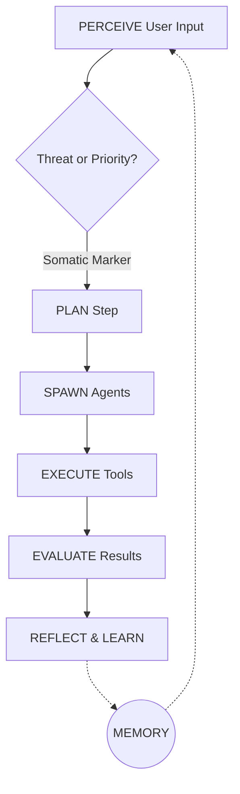

<div align="center">
  <h1>🧠 CMAS</h1>
  <h3>Your Own Personal AI Assistant. Any Platform. The Cognitive Way. 🧠</h3>

  <p>
    <a href="#"></a>
    <a href="#"></a>
    <a href="#"></a>
    <a href="#"></a>
  </p>

  <p><em>An always-on, highly-steerable agentic framework powered by brain-inspired intelligence.</em></p>
</div>

---

> **CMAS** is a persistent, 24/7 AI platform that dynamically spawns specialized sub-agents, launches deep multi-step research investigations, safely executes code, manages custom long-term persistence, and actively learns from every interaction using localized dopamine-reward pathways.

## ✨ Highlights

* **100% Autonomous:** Capable of running long-term tasks without supervision.
* **Brain-Inspired Metrics:** Uses Hebbian weighting and Default-Mode Network (DMN) states to learn in the background.
* **Highly Steerable:** Send immediate override commands to the internal cognitive loop even while it's mid-thought.
* **Open & Private:** No forced cloud vendors. Plug in your own `.env` API keys for **OpenAI**, **Local HuggingFace TGI**, or **Ollama**.

---

## 🚀 Quick start (TL;DR)

Getting started with CMAS takes less than 60 seconds thanks to our interactive bash installer.

```bash
# 1. Clone the repository
git clone https://github.com/joshdeansavv/CMAS.git
cd CMAS

# 2. Run the automated interactive wizard
./setup.sh

# 3. Boot the AGI Framework and hit localhost:8080!
./start.sh
```

---

## 📦 Everything we built so far

CMAS isn't just a chatbot, it's a rapidly expanding entire ecosystem of specialized nodes, channels, and apps.

### Core Platform
- **Orchestrator Node:** The central routing processor that decomposes goals into sub-tasks via `PERCEIVE → PLAN → EXECUTE → EVALUATE`.
- **Memory Consolidation:** Automatic translation of long-lived chat history into vectorized Schemas.
- **Personality Configurator:** Dynamically load `personality.yaml` settings to adjust logic boundaries and constraints.

### Channels
Access your AI Assistant from wherever you are. Messages instantly synchronize state across all networks.
- [x] **WebChat:** Locally hosted Vite/React GUI via `http://localhost:8080`.
- [x] **Discord:** Native bot integration via `@Mentions` and DMs.
- [x] **WhatsApp:** Enterprise hooks via Twilio messaging layer.

### Apps & Nodes
- **Live Observability HUD:** The React web app directly streams gateway events, rendering internal loop thoughts without polluting the chat.
- **Agent Roster:** Watch specialized sub-agents (`ResearchAgent`, `AnalystAgent`) get dynamically spawned and tore down by the main orchestrator in real time.
- **Background Job Scheduler:** Inject autonomous CRON jobs via natural language (e.g. *"Remind me to check server health at 9am"*).

### Tools & Automation
CMAS ships with a powerful native capability registry out-of-the-box.
- **Local Bash Access:** Run sandboxed shell commands safely on the host machine.
- **System Crawler:** Native disk-read operations and file synthesis execution.
- **Dynamic Sub-Agent Spawning:** Agents can `find_sessions`, `switch_sessions`, and orchestrate entirely new hierarchical agent worker colonies for big tasks.

### Runtime & Safety
- **Anti-Spam Gateway Loop:** Intelligent circuit-breakers detect recursive logic loops and physically halt runaway LLM execution.
- **Explicit Workspace Sandboxing:** All file system mutations are hard-coded to strict `/workspace/` subdirectories to prevent host machine gunking.
- **Interactive Steering Protocol:** Inject raw commands directly to the core inference threads bypassing the conversational interface.

---

## ⚙️ How it works (short)

When you ask CMAS to accomplish a task via Discord or Web, it travels through several cognitive phases:



1. The **Gateway** normalizes your input across any incoming channel.
2. The **Orchestrator** loads your active `Session Context` from SQLite.
3. CMAS recursively spins up `chat_with_tools` loops to query duckduckgo, read files, or launch sub-agents.
4. If a loop is infinite or hanging, the **Gateway Guardrails** snap it gracefully.
5. In idle periods, CMAS fires up the **Default Mode Network (DMN)** to ponder your old questions and generate "creative insights" stored via ChromaDB.

---

## 🔒 Security model (important)

**Your data stays yours.**
* API Keys (`OPENAI_API_KEY`) are stored explicitly in your untracked `.env` file. They never leave your device.
* All `write_file` and `exec` tool definitions are firmly rooted inside `src/cmas/workspace`.
* Local `.db` files remain locally encrypted natively on your disk.

---

## 📚 Psychological Foundations

Our cognitive logic is meticulously mapped to highly verified academic frameworks:

| Concept | Source | Implementation |
|---------|--------|---------------|
| Hebbian learning | *Hebb (1949)* | Neural pathway weight updates |
| Dopamine prediction error | *Schultz (1997)* | Reward-driven strategy learning |
| Somatic markers | *Damasio (1994)* | Fast priority/threat assessment |
| Default Mode Network | *Raichle (2001)* | Background creative processing |
| Creative cognition | *Beaty (2018)* | Cross-domain insight generation |
| Complementary Learning | *McClelland (1995)* | Memory consolidation & schemas |

---

<div align="center">
  <i>Built with ❤️ by joshdeansavv. Licensed for strictly Non-Commercial Open-Source use to protect user integrity.</i>
</div>
