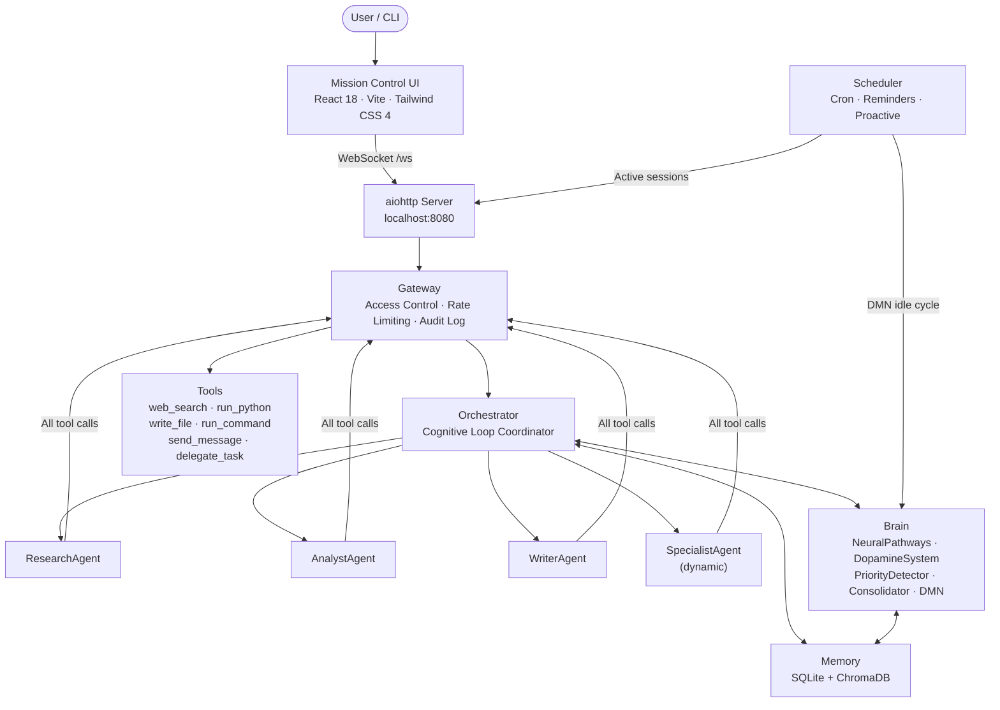
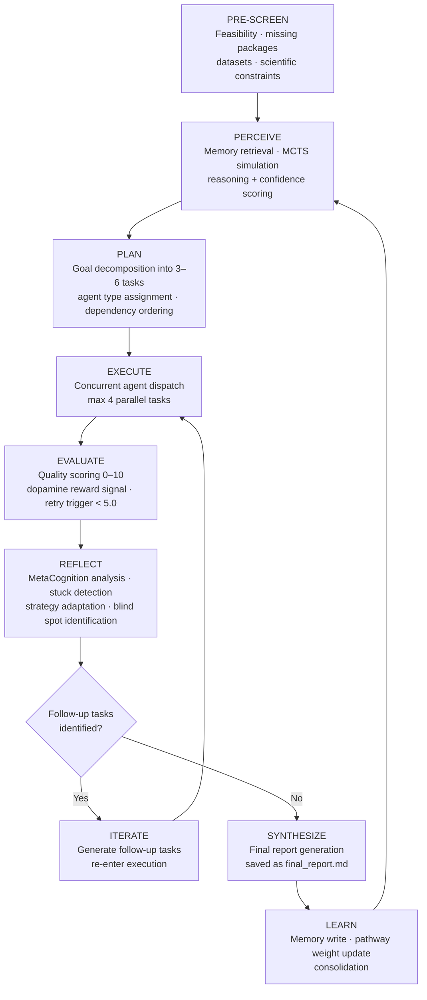
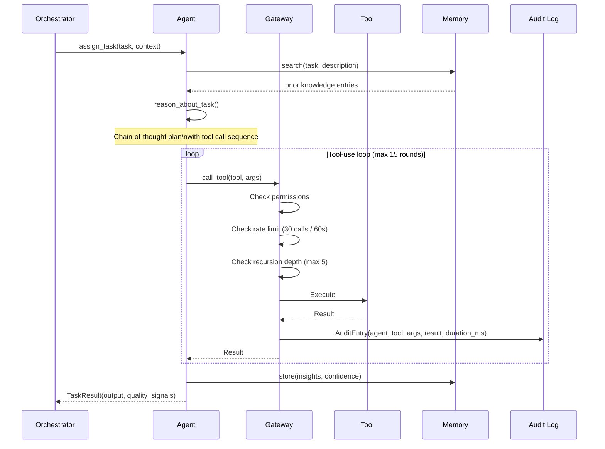
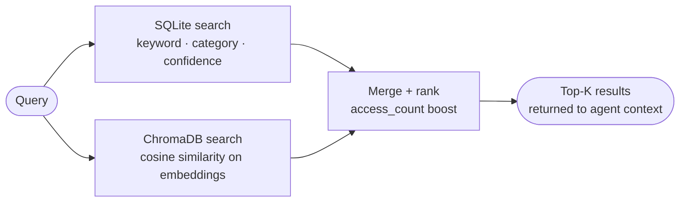

<div align="center">

# CMAS

**Cognitive Multi-Agent System**

<sub>An always-on agentic orchestration platform with a neuroscience-inspired cognitive architecture, persistent memory, and a real-time web interface.</sub>

---


</div>

---

## Overview

CMAS is not a chatbot wrapper. It is a persistent cognitive environment that orchestrates specialized AI agents through an eight-phase loop — Pre-Screen, Perceive, Plan, Execute, Evaluate, Reflect, Iterate, Synthesize — running against goals you define.

The architecture draws from cognitive neuroscience: Hebbian learning governs agent routing through a weighted pathway graph, a dopamine-inspired prediction error signal calibrates quality expectations, a Default Mode Network synthesizes creative insights during idle periods, and a metacognition layer detects and recovers from stuck states. State, memory, and learned behaviors persist across restarts, sessions, and projects.

---

## Table of Contents

- [System Architecture](#system-architecture)
- [Cognitive Loop](#cognitive-loop)
- [Agent Execution Flow](#agent-execution-flow)
- [Core Modules](#core-modules)
  - [Orchestrator](#orchestrator)
  - [Gateway](#gateway)
  - [Memory](#memory)
  - [Brain](#brain)
  - [Agents](#agents)
  - [Reasoning and MetaCognition](#reasoning-and-metacognition)
  - [Scheduler](#scheduler)
- [Tool System](#tool-system)
- [Memory Architecture](#memory-architecture)
- [Database Schemas](#database-schemas)
- [Personality and Agent Config](#personality-and-agent-config)
- [Web Interface](#web-interface)
- [Installation](#installation)
- [Configuration](#configuration)
- [CLI Reference](#cli-reference)
- [Channels](#channels)
- [Project Structure](#project-structure)
- [License](#license)

---

## System Architecture



All agent-to-tool communication is gated exclusively through the Gateway. No agent calls a tool directly.

---

## Cognitive Loop

Every execution — one-shot or continuous server session — runs the same eight-phase loop managed by the Orchestrator:



| Phase | Detail |
|---|---|
| **Pre-Screen** | Analyzes goal feasibility before any LLM work. Identifies missing packages, missing datasets, and hard scientific constraints. Returns structured feasibility report. |
| **Perceive** | Retrieves semantically similar prior knowledge from memory. Runs Monte-Carlo Tree Search (MCTS) simulations to evaluate candidate approaches before committing to a plan. |
| **Plan** | Decomposes the goal into 3–6 concrete, dependency-ordered tasks. Each task includes agent type (`research`, `analyst`, `writer`, `specialist:<domain>`) and explicit dependencies. |
| **Execute** | Dispatches ready tasks concurrently (limited by `max_concurrent_agents`). Each agent runs its own reason-act-reflect sub-loop. Dependencies are resolved dynamically as tasks complete. |
| **Evaluate** | Scores each task output on four axes: relevance, completeness, accuracy, clarity (0–10). Triggers dopamine reward signals. Auto-generates retry tasks for scores below 5.0. |
| **Reflect** | MetaCognition reviews what worked, what failed, and detects stuck patterns (flat/declining quality delta). Triggers creative strategy adaptation when stuck. |
| **Iterate** | If gaps remain, generates 1–3 follow-up tasks and re-enters the Execute phase. If the goal is well-addressed, proceeds to synthesis. |
| **Synthesize** | Combines all agent outputs into a final markdown report. Stores the report in memory with confidence 0.7. Broadcasts completion to active UI sessions. |

Human-in-the-loop mode (`--human`) pauses for steering input at the Plan, Iterate, and Synthesize boundaries.

---

## Agent Execution Flow



---

## Core Modules

### Orchestrator

`src/cmas/core/orchestrator.py` — 807 lines

The Orchestrator is the cognitive core. It owns the full eight-phase loop and holds references to every other system: Hub, Gateway, Memory, Brain, Reasoner, Evaluator, and MetaCognition. It does not execute tasks itself — it decomposes, assigns, monitors, and synthesizes.

Key responsibilities:
- Calling `reasoning.py` to produce structured task trees with dependency graphs
- Managing concurrent task dispatch (up to `max_concurrent_agents` in parallel)
- Running MCTS in the Perceive phase to evaluate candidate approaches before committing
- Triggering `MetaCognition` when quality delta is flat across cycles
- Calling `DopamineSystem.process_reward()` after each task evaluation
- Writing compressed schemas and lessons to Memory via `Consolidator` at loop end

### Gateway

`src/cmas/core/gateway.py` — 508 lines

Every tool call in the system passes through the Gateway before execution. This is the single enforcement point for access control, rate limiting, recursion prevention, and audit logging. The Gateway also exposes Mission Control C2 commands for real-time task management.

**Tool permissions per agent type:**

| Agent | Permitted Tools |
|---|---|
| ResearchAgent | `web_search` `write_file` `read_file` `list_files` `run_python` `send_message` |
| AnalystAgent | `web_search` `write_file` `read_file` `list_files` `run_python` `send_message` |
| WriterAgent | `write_file` `read_file` `list_files` `run_python` `send_message` |
| SpecialistAgent | `web_search` `write_file` `read_file` `list_files` `run_python` `send_message` |

**Enforcement chain per call:**

1. Permission check against `DEFAULT_PERMISSIONS[agent_type]`
2. Rate limit check: 30 calls per 60-second sliding window per agent
3. Recursion depth check: max depth 5 for `delegate_task` chains
4. Execute tool
5. Write `AuditEntry` to log and broadcast via `on_audit_event` callback

**Mission Control C2 interface:**

```python
gateway.pause_task(task_id)    # Suspend agent mid-execution
gateway.resume_task(task_id)   # Resume paused agent
gateway.stop_task(task_id)     # Terminate via asyncio.CancelledError
gateway.check_interrupt(task_id, agent_name)  # Hardware-level interception point
```

**Audit entry structure:**

```python
AuditEntry(
    timestamp   = "2025-01-15T14:32:01.123Z",
    agent       = "ResearchAgent",
    action      = "tool_call",
    tool        = "web_search",
    args_summary = '{"query": "quantum error correction"}',
    result_summary = "...",
    allowed     = True,
    task_id     = "task_03",
    duration_ms = 840
)
```

### Memory

`src/cmas/core/memory.py` — 10.8 KB

CMAS maintains two parallel stores searched jointly on every retrieval:

| Store | Technology | Purpose |
|---|---|---|
| Knowledge store | SQLite | Structured facts: category, topic, source, confidence (0–1), access count |
| Lessons store | SQLite | `what_happened` + `what_learned`, keyed to agent type and project |
| Vector store | ChromaDB | Semantic embedding search for conceptual retrieval |

Memory is **global across projects by default**. Knowledge gained in one project surfaces as context in others.

Core operations:
- `Memory.store(category, topic, content, confidence)` — write a knowledge entry; vectors generated at write time
- `Memory.search(query, top_k)` — combined keyword + cosine similarity search, ranked by access frequency
- `Memory.learn(what_happened, what_learned, applies_to)` — write a lesson entry
- Access counts increment on every retrieval — frequently-used knowledge rises in ranking automatically

### Brain

`src/cmas/core/brain.py` — 640 lines

Five neuroscience-inspired subsystems that run alongside (not instead of) the main reasoning pipeline.

<details>
<summary><strong>NeuralPathways</strong> — Hebbian agent routing (click to expand)</summary>

Maintains a weighted directed graph where edges represent agent-to-agent delegation relationships. Edge weights strengthen on successful downstream outcomes (Long-Term Potentiation) and weaken on failures (Long-Term Depression). The Orchestrator consults pathway weights when assigning tasks to agent types.

```
# Strengthen (LTP)
weight_new = weight_old + 0.05

# Weaken (LTD)
weight_new = weight_old - 0.03

# Synaptic pruning (daily decay on unused pathways)
weight_new = weight_old * decay_factor

# Homeostatic scaling (prevents runaway weights)
if any_weight > 2x average: rescale all weights
```

Agent selection uses epsilon-greedy exploration (ε=0.1): 10% of the time a random eligible agent is chosen regardless of pathway weights, ensuring the system continues to explore rather than over-exploit current high-weight routes.

Stored in `brain.db`:
```sql
CREATE TABLE pathways (
    source        TEXT,
    target        TEXT,
    weight        REAL DEFAULT 0.5,
    success_count INTEGER DEFAULT 0,
    failure_count INTEGER DEFAULT 0,
    last_used     TIMESTAMP,
    PRIMARY KEY (source, target)
);
```

</details>

<details>
<summary><strong>DopamineSystem</strong> — Prediction error and reward signal (click to expand)</summary>

Maintains a rolling baseline of expected quality per agent type. Computes prediction error as `actual - expected`. Positive error strengthens the responsible pathway; negative error weakens it and may escalate to MetaCognition.

```
prediction_error  = actual_quality - expected_baseline
expected_baseline = baseline * 0.95 + actual_quality * 0.05
```

The exponential moving average on the baseline means quality expectations rise as average output improves, preventing the system from calibrating to a mediocre floor.

Output: `RewardSignal(task_id, agent, expected_quality, actual_quality, prediction_error, timestamp)`

</details>

<details>
<summary><strong>PriorityDetector</strong> — Urgency classification (click to expand)</summary>

Scans task descriptions for urgency markers and dependency blockers. Returns a priority level used to order the task queue.

Priority levels: `CRITICAL (3)` → `URGENT (2)` → `IMPORTANT (1)` → `BACKGROUND (0)`

Urgency keywords scanned: `critical`, `urgent`, `immediately`, `asap`, `deadline`, `emergency`, `breaking`, `security`, `failure`, `crash`, `blocked`, `stuck`

Also implements a somatic marker mechanism: given a proposed strategy and a history of past results, it computes a failure rate and warns if the approach has failed before. This is a lightweight form of fear conditioning.

</details>

<details>
<summary><strong>Consolidator</strong> — Memory compression (click to expand)</summary>

Periodically sweeps recent task executions and compresses them into reusable higher-level schemas. Extracts:
- **Strategy schemas** — generalizable patterns that worked
- **Novel hypotheses** — inferences not explicitly stated in task results
- **Anti-patterns** — approaches that failed and should be avoided

Stored in Memory with lower confidence (0.3–0.5) to indicate they are inferred rather than directly observed. Prevents memory from growing unboundedly while preserving generalizable knowledge.

</details>

<details>
<summary><strong>DefaultModeNetwork (DMN)</strong> — Background creative synthesis (click to expand)</summary>

Runs on the Scheduler's proactive cycle (every 5 minutes by default) when no active task is executing. Performs four sub-processes:

1. **Spontaneous recombination** (temperature=0.9) — retrieves recent memory entries and attempts creative cross-domain synthesis
2. **Problem incubation** (60% probability) — deep exploration of unresolved open questions stored in memory
3. **Autonomous curiosity** — generates and executes web searches for topics the system has flagged as interesting but unexplored
4. **Semantic schema synthesis** — builds higher-order conceptual structures from clusters of related entries

Insights are stored back into Memory with a `dmn_generated` tag. This is the mechanism behind proactive behavior: a new goal may already have partially relevant DMN-synthesized context waiting when the Perceive phase runs.

</details>

### Agents

`src/cmas/core/agent.py` — 404 lines

Four concrete agent types share a common `Agent` base class:

| Type | Role | Workspace |
|---|---|---|
| `ResearchAgent` | Web search, document retrieval, fact synthesis | `workspace/research/` |
| `AnalystAgent` | Code execution, data analysis, computation | `workspace/analysis/` |
| `WriterAgent` | Document generation, summarization, structured output | `workspace/reports/` |
| `SpecialistAgent` | Dynamic domain expert (name derived from specialty) | `workspace/<name>/` |

Each agent runs the same sub-loop:

```
1. reason_about_task(task)
   ├── retrieve prior knowledge from Memory
   └── generate chain-of-thought plan with tool call sequence

2. act(plan)
   └── tool-use loop via chat_with_tools() — max 15 rounds per task

3. reflect(task, result)
   ├── assess whether result answers the task
   └── store new knowledge in Memory
```

The `depth` counter on each agent tracks recursion from `delegate_task` calls. The Gateway enforces the hard cap of 5.

### Reasoning and MetaCognition

`src/cmas/core/reasoning.py` — 13.9 KB
`src/cmas/core/metacognition.py` — 13.9 KB

**Reasoning** produces structured JSON from natural language goals, used by the Orchestrator during the Plan phase:

```json
{
  "understanding": "The user wants to identify optimal deployment strategy...",
  "assumptions":   ["Infrastructure is cloud-based", "Cost is a constraint"],
  "steps":         ["Research current patterns", "Model cost scenarios", "..."],
  "key_insights":  ["Blue-green deployments eliminate downtime but double infra cost"],
  "confidence":    0.82,
  "unknowns":      ["Current monthly infrastructure spend"]
}
```

Methods: `think_step_by_step()`, `hypothesize()`, `identify_cause_effect()`, `transfer_knowledge(source_domain, target_domain)`

**MetaCognition** monitors cycle-over-cycle quality and intervenes when the system is stuck:

- `reflect(history)` — produces structured analysis of what worked and why
- `detect_stuck(recent_scores)` — identifies flat or declining quality delta over N consecutive cycles
- `adapt_strategy(current_approach)` — generates alternative decomposition strategies
- `generate_novel_angles(goal)` — reframes the goal when standard approaches have failed

When stuck is detected, MetaCognition signals the Orchestrator to discard the current task tree and re-plan from an alternative angle rather than re-running the same tasks.

### Scheduler

`src/cmas/core/scheduler.py` — 174 lines

Runs as a background asyncio coroutine alongside the aiohttp server.

| Job | Interval | Behavior |
|---|---|---|
| Reminder check | 30 seconds | Fire due reminders to active sessions; disable one-time jobs after firing |
| Cron executor | 30 seconds | Run enabled cron jobs (croniter-based); calculate and write `next_run` |
| Proactive cycle | 300 seconds (configurable) | Trigger DMN idle synthesis |

All jobs are persisted to `data/cmas.db` with full cron expressions, making them durable across restarts.

---

## Tool System

`src/cmas/core/tools.py` — 252 lines

Eight tools are available. All calls are gated through the Gateway before execution.

| Tool | Signature | Notes |
|---|---|---|
| `web_search` | `(query, max_results=5)` | Tavily API. Returns ranked results with title, URL, snippet. Requires `TAVILY_API_KEY`. |
| `write_file` | `(path, content)` | Creates intermediate directories. Returns char count and path. |
| `read_file` | `(path)` | Max 10,000 chars; truncates with explicit notice. |
| `list_files` | `(directory)` | Recursive glob, max 100 results, returns JSON. |
| `run_python` | `(code)` | Subprocess with 60s timeout. Captures stdout + stderr (max 5,000 chars). |
| `run_command` | `(command, timeout=30)` | Shell execution via bash. Returns stdout + stderr (max 5,000 chars). |
| `send_message` | `(recipient, content)` | Inter-agent communication via Hub. Use `"SwarmChannel"` to broadcast to all agents. |
| `delegate_task` | `(specialty, task)` | Spawns a SpecialistAgent for `specialty` as a background coroutine. Subject to recursion depth limit. |

Tools are defined in OpenAI function-calling format and can be used with any OpenAI-compatible API endpoint.

---

## Memory Architecture



Vector embeddings are generated at write time. Retrieval blends both stores with equal weight by default. Entries with a higher `access_count` receive a small ranking boost.

Two memory tables coexist: `knowledge` for facts and observations, `lessons` for reflective entries that record what happened and what was learned. The `lessons` table is scoped to agent type and project context, allowing the system to apply prior lessons selectively rather than globally.

---

## Database Schemas

<details>
<summary><strong>Memory</strong> — <code>data/cmas_memory.db</code></summary>

```sql
CREATE TABLE knowledge (
    id           INTEGER PRIMARY KEY AUTOINCREMENT,
    category     TEXT,
    topic        TEXT,
    content      TEXT,
    source       TEXT,
    project      TEXT,
    confidence   REAL DEFAULT 0.8,
    created_at   TIMESTAMP DEFAULT CURRENT_TIMESTAMP,
    accessed_at  TIMESTAMP,
    access_count INTEGER DEFAULT 0
);

CREATE TABLE lessons (
    id            INTEGER PRIMARY KEY AUTOINCREMENT,
    what_happened TEXT,
    what_learned  TEXT,
    applies_to    TEXT,
    project       TEXT,
    created_at    TIMESTAMP DEFAULT CURRENT_TIMESTAMP
);
```

</details>

<details>
<summary><strong>State Hub</strong> — <code>.c2_mission_data/hub.db</code></summary>

```sql
CREATE TABLE projects (
    id         TEXT PRIMARY KEY,
    name       TEXT,
    focus      TEXT,
    status     TEXT,
    created_at TIMESTAMP DEFAULT CURRENT_TIMESTAMP
);

CREATE TABLE tasks (
    id             TEXT PRIMARY KEY,
    description    TEXT,
    assigned_to    TEXT,
    status         TEXT,  -- PENDING | IN_PROGRESS | DONE | FAILED | BLOCKED | PAUSED | KILLED
    project_id     TEXT,
    result         TEXT,
    parent_task_id TEXT
);

CREATE TABLE agents (
    name         TEXT PRIMARY KEY,
    role         TEXT,
    status       TEXT,
    current_task TEXT,
    project_id   TEXT
);

CREATE TABLE messages (
    id        INTEGER PRIMARY KEY AUTOINCREMENT,
    sender    TEXT,
    recipient TEXT,
    content   TEXT,
    timestamp TIMESTAMP DEFAULT CURRENT_TIMESTAMP
);
```

</details>

<details>
<summary><strong>Sessions and Scheduler</strong> — <code>data/cmas.db</code></summary>

```sql
CREATE TABLE sessions (
    session_id  TEXT PRIMARY KEY,
    user_id     TEXT,
    project_id  TEXT,
    created_at  TIMESTAMP DEFAULT CURRENT_TIMESTAMP,
    last_active TIMESTAMP
);

CREATE TABLE messages (
    id         INTEGER PRIMARY KEY AUTOINCREMENT,
    session_id TEXT,
    role       TEXT,  -- user | assistant | system
    content    TEXT,
    timestamp  TIMESTAMP DEFAULT CURRENT_TIMESTAMP
);

CREATE TABLE scheduled_jobs (
    id          INTEGER PRIMARY KEY AUTOINCREMENT,
    session_id  TEXT,
    channel     TEXT,
    job_type    TEXT,      -- reminder | cron
    description TEXT,
    schedule    TEXT,      -- ISO timestamp or cron expression
    enabled     BOOLEAN DEFAULT 1,
    next_run    TIMESTAMP,
    last_run    TIMESTAMP
);
```

</details>

<details>
<summary><strong>Brain Pathways</strong> — <code>project_dir/brain.db</code></summary>

```sql
CREATE TABLE pathways (
    source        TEXT,
    target        TEXT,
    weight        REAL DEFAULT 0.5,
    success_count INTEGER DEFAULT 0,
    failure_count INTEGER DEFAULT 0,
    last_used     TIMESTAMP,
    PRIMARY KEY (source, target)
);
```

</details>

---

## Personality and Agent Config

**`personality.yaml`** defines the system's behavioral directives, applied across all agent interactions:

```yaml
agent_name: "CMAS Core"
focus: "Comprehensive problem solving, deep programming and analysis, and actionable data synthesis."
tone: "Professional, extremely capable, and direct."

directives:
  - "Always verify facts via web_search or memory before asserting them."
  - "When analyzing code, prioritize security, performance, and best practices."
  - "Actively create your own reminders if a task requires later follow-up."
  - "Automatically switch project or session context quickly when the user requests."
  - "Format dense data into readable markdown lists or tables."
```

**`configs/agents.json`** specifies per-agent API and model preferences, allowing different agents to use different providers:

```json
{
  "research_agent": {
    "preferred_apis": ["tavily", "openai"],
    "preferred_models": ["gpt-4.1-nano", "gpt-5-nano"]
  },
  "people_agent": {
    "preferred_apis": ["tavily", "openai"],
    "preferred_models": ["gpt-4.1-mini", "gpt-5-mini"]
  },
  "special_agent": {
    "preferred_apis": ["kimi"],
    "preferred_models": ["k2.5"],
    "kimi_access": true
  }
}
```

---

## Web Interface

`src/cmas/core/server.py` — 508 lines
`src/cmas/web-app/` — React 18, Vite, Tailwind CSS 4, Lucide icons

The aiohttp server exposes both a REST API and a WebSocket endpoint:

| Route | Method | Description |
|---|---|---|
| `/ws` | WebSocket | Real-time swarm feed: audit events, task status changes, agent state, telemetry |
| `/api/workspace` | GET | List workspace projects |
| `/api/projects` | GET · POST | Project CRUD |
| `/api/agents` | GET | Current agent status across all active projects |
| `/api/tasks` | GET | Full task list with status and results |
| `/*` | GET | Serve compiled Vite bundle from `web-app/dist/` |

WebSocket messages are broadcast per-project. Clients only receive events for the active project.

The frontend (`App.jsx`, 64.7 KB) provides:
- Real-time agent activity feed and task tree view
- Inline audit log per task (expandable per agent action)
- Project manager (create, switch, archive)
- Live telemetry panel for Brain module state

Build the frontend:

```bash
cd src/cmas/web-app
npm install
npm run build
```

The compiled bundle lands in `web-app/dist/` and is served directly by the aiohttp server on startup.

---

## Installation

**Requirements:** Python 3.9+, Node.js 18+ (for frontend build), OpenAI API key.

```bash
git clone https://github.com/joshdeansavv/CMAS.git
cd CMAS/MAIN_FOLDER

# Interactive setup — checks Python version, creates venv, installs
# dependencies, prompts for API keys, generates config.yaml and .env
./setup.sh

# Launch server
./start.sh
```

Open `http://localhost:8080` once the server is running.

---

## Configuration

**`.env`** — secrets and environment overrides (never committed):

```bash
OPENAI_API_KEY=sk-...          # Required
OPENAI_BASE_URL=...            # Optional — override for compatible endpoints
TAVILY_API_KEY=tvly-...        # Optional — enables web_search tool
DISCORD_TOKEN=...              # Optional — enables Discord channel
TWILIO_ACCOUNT_SID=...         # Optional — enables WhatsApp channel
TWILIO_AUTH_TOKEN=...
TWILIO_PHONE_NUMBER=...
CMAS_PORT=8080
CMAS_TIMEZONE=America/New_York
```

**`config.yaml`** — runtime behavior (see `config.example.yaml` for full reference):

```yaml
server:
  host: "0.0.0.0"
  port: 8080

models:
  default: gpt-4.1-nano      # Lightweight reasoning and routing
  research: gpt-4.1-mini     # Research and analysis tasks
  temperature: 0.7

scheduler:
  proactive_interval: 300    # DMN idle cycle in seconds
  enabled: true

memory:
  sqlite_path: .c2_mission_data/hub.db
  vector_db_path: .c2_mission_data/vectors
  max_context_messages: 50

workspace:
  base_dir: .c2_mission_workspace

channels:
  web:
    enabled: true
  discord:
    enabled: false
  whatsapp:
    enabled: false
```

Configuration precedence: `environment variables > config.yaml > defaults`. Environment variables always win.

---

## CLI Reference

```bash
# Start the server (default port 8080)
python3 -m cmas

# Custom port
python3 -m cmas -p 3000

# Custom config file
python3 -m cmas -c /path/to/config.yaml

# One-shot research mode — no server, no UI, result to stdout
python3 -m cmas --run "Summarize recent papers on transformer attention efficiency"

# One-shot with options
python3 -m cmas --run "Goal" \
    --model gpt-4o \
    --iterations 5 \
    --human              # Pause at each phase boundary for steering input

# Timezone override
python3 -m cmas --timezone "Europe/London"
```

One-shot mode (`--run`) runs the full cognitive loop for the specified number of iterations and exits. No server is started. Useful for scripting, pipelines, and automated research tasks.

---

## Channels

All channels converge on the same Orchestrator and Memory. Switching channels does not change how the system thinks.

| Channel | Transport | Config |
|---|---|---|
| Web | WebSocket (built-in) | Always available — no extra setup |
| Discord | Discord Bot API | `DISCORD_TOKEN` + `channels.discord.enabled: true` |
| WhatsApp | Twilio API | Twilio credentials + `channels.whatsapp.enabled: true` |

---

## Project Structure

```
MAIN_FOLDER/
├── setup.sh                       # Interactive setup wizard
├── start.sh                       # Activate venv and launch server
├── config.yaml                    # Active configuration
├── config.example.yaml            # Annotated configuration reference
├── personality.yaml               # System behavioral directives
├── configs/
│   └── agents.json                # Per-agent API and model preferences
├── data/
│   ├── cmas.db                    # Sessions and scheduled jobs
│   └── cmas_memory.db             # Persistent knowledge and lessons
│
└── src/cmas/
    ├── __main__.py                # Entry point (python3 -m cmas)
    ├── cli.py                     # Argument parsing
    │
    ├── core/
    │   ├── orchestrator.py        # Eight-phase cognitive loop (807 lines)
    │   ├── brain.py               # Five neural subsystems (640 lines)
    │   ├── gateway.py             # Access control, rate limiting, audit (508 lines)
    │   ├── chat.py                # Conversational session handler (34 KB)
    │   ├── agent.py               # Agent types and execution sub-loop (404 lines)
    │   ├── reasoning.py           # Structured thinking engine (14 KB)
    │   ├── metacognition.py       # Self-awareness and adaptation (14 KB)
    │   ├── state.py               # Shared state Hub, SQLite-backed (14 KB)
    │   ├── server.py              # aiohttp server and routes (13 KB)
    │   ├── memory.py              # Persistent knowledge store (11 KB)
    │   ├── tools.py               # Tool implementations (252 lines)
    │   ├── llm.py                 # OpenAI client, retry logic, fallback chain (8 KB)
    │   ├── session.py             # Session management (8 KB)
    │   ├── scheduler.py           # Background scheduler (174 lines)
    │   ├── evaluation.py          # Quality scoring engine (7 KB)
    │   ├── config.py              # Config loader with precedence chain (4 KB)
    │   └── vector.py              # ChromaDB wrapper (4 KB)
    │
    ├── channels/
    │   └── web.py                 # WebSocket channel handler
    │
    └── web-app/
        ├── src/App.jsx            # Main UI component (64.7 KB)
        ├── package.json
        └── vite.config.js
```

---

## License

CMAS is distributed under the **PolyForm Noncommercial License 1.0.0**.

This is a source-available, noncommercial license. You may use, modify, and distribute the software freely for personal, academic, and non-commercial purposes. Commercial use — including SaaS deployment, embedding in commercial products, or using the software to support revenue-generating operations — requires a separate commercial license.

See [LICENSE](./LICENSE) for the full terms. For commercial licensing inquiries, contact the copyright holder.

---

<div align="center">
<sub>Built by joshdeansavv</sub>
</div>
